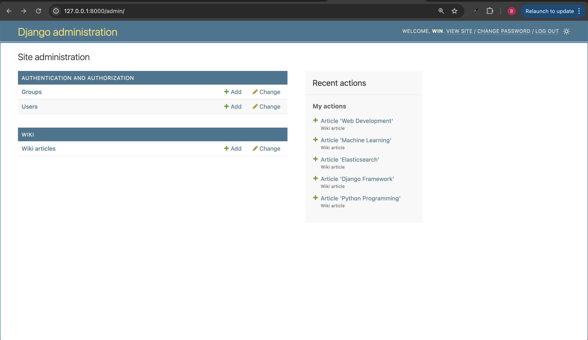
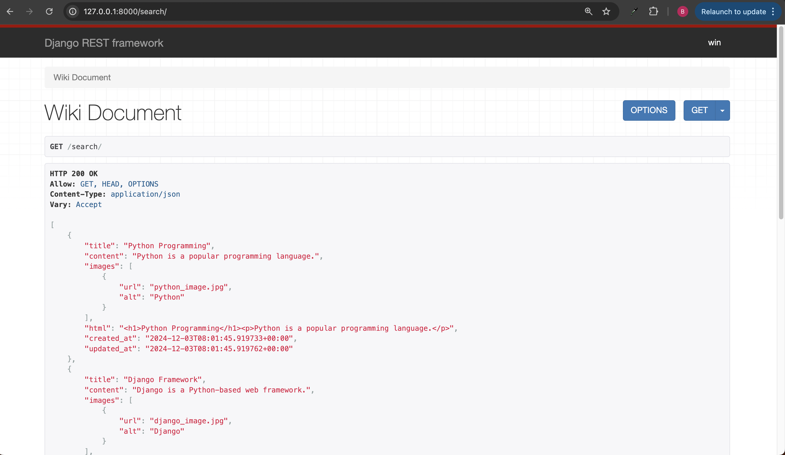
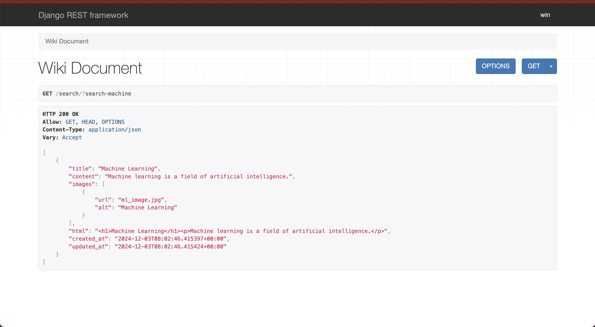

# **Briefly - Setup Guide**

This setup is using Docker to host ElasticSearch Database. Please install Docker before proceed.

## Installation

0. Clone the repository
```bash
$ git clone https://github.com/Shibainu13/Briefly.git
```

1. Run Docker, then enter the following commands into terminal. This step is only required for the first time setting up. For the next entries, we only need to run the server from Docker GUI:
```bash
$ docker network create elastic
$ docker pull docker.elastic.co/elasticsearch/elasticsearch:8.16.1
$ docker run -d --name elasticsearch \
  --net elastic \
  -p 9200:9200 -p 9300:9300 \
  -e "discovery.type=single-node" \
  -e "xpack.security.enabled=false" \
  docker.elastic.co/elasticsearch/elasticsearch:8.16.1
```
Alternatively, **Elasticsearch** offers a variety of installing methods, you can go for any of these as long as the endpoints for Elasticsearch Database is at **http://localhost:9200**.

2. Install the necessary dependencies
```bash
$ pip install -m requirements.txt
$ cd backend
$ python manage.py makemigrations
$ python manage.py migrate
```

3. Test to see if the elasticsearch is setup
```bash
$ python manage.py test
```

4. Test search API:
```bash
$ python manage.py createsuperuser
$ python manage.py runserver
```
After the server is up, go to /admin to login and create some sample WikiArticles. The search API is located at /search



